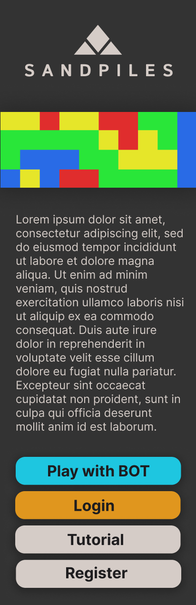
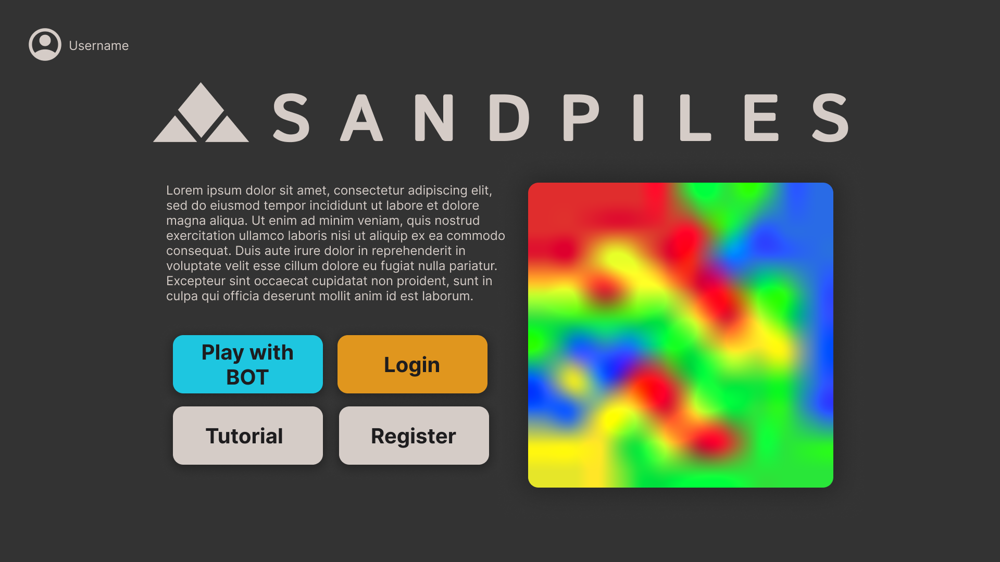

<!-- _class: lead invert -->
<!-- _paginate: false -->

# Sandpiles

Andrea Biagini
Filippo Gurioli
Leonardo Randacio

---

Piattaforma per gioco competitivo da 2 giocatori 

---

## Funzionalità:

- Creazione account
- Partita PVP
- Partita PVE
- Visualizzare classifica

---

## Design:

- Mockup
- Tech stack MEVN
- Sockets/REST API

---

## Mockup

Mockup con figma:

---

## Mockup

Mockup con figma:

---

## Tech Stack

- MongoDB come database
- Express per il backend
- Vue per il frontend
- Typescript
- Scss
- MDBootstrap
- Jest per test backend
- Docker per containerizzazione e deployment
- Prolog per AI

---

## Sockets/Rest API

- Tutte le api sono sotto il subdomain `/account`
- Account:
    - POST `/register`: registra un nuovo account
      - body: username, email, password
      - response: 201, 400 - invalid input, 409 - account exists, 500
    - POST `/login`: consente l'accesso ad un utente già registrato
      - body: username, password
      - response: 200 - salva il cookie, 409, 500
    - POST `/logout`: invalida l'access token dell'utente
      - cookie: cookieId per il token salvato nel server
      - response: 200, 401 - expired or invalid token
    - POST `/me`: restituisce i dati utente (username + email)
      - cookie: cookieId per il token salvato nel server
      - response: 200, 401 - expired or invalid token
    - emit('changeEmail'): cambia la mail dell'utente
    - emit('deleteAccount'): elimina l'account

---

## Sockets/Rest API

- Matchmaking:
    - Client:
        - emit('requestMatch'): Richiesta partita PVP
        - emit('requestMatchWithBot'): Richiesta partita PVE
    - Server:
        - emit('matchFound', { matchId: string }): Notifica partita trovata

---

## Sockets/Rest API

- Match:
    - Client:
        - emit('getMatch'): Richiesta stato partita
        - emit('addMove'): Invia mossa
        - emit('matchHistory', <username>): Richiesta cronologia partite
    - Server:
        - emit('move'): Notifica mossa eseguita
        - emit('over'): Notifica partita finita

---

## Sockets/Rest API

- Namespaces per determinare accesso a 'endpoint'
- Rooms per giocatori in partita
- Middleware per auth

---

## Ux

Considerate le Euristiche di Nielsen:

- Pro:
    - Stile coerente
    - Linguaggio standardizzato
    - Tutorial Sandpiles
    - Navigabilità buona
- Contro:
    - Un solo modo per fare le cose
    - Documentazione su utilizzo sito scarna

---

## Dettagli

- Cookies per autologin
- Matchmaking
- Salt e hash password in DB
- Responsive Design

---

## Idee per il futuro

- Username non univoci
- Cronometro per le partite
- Replay history partite
- Pagina guida per l'utente

